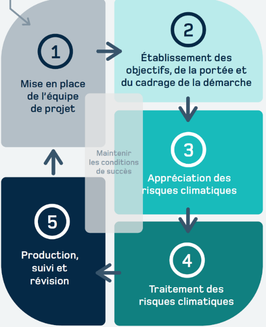

# The climate change adaptation process {#sec-B1}

Climate change will lead to significant changes in several climate
variables. These unprecedented climatic conditions will undermine the
functionality of several types of infrastructure, compromise many
services, disrupt socio-economic activities, harm the public’s health
and quality of life, and endanger various natural systems and the
survival of certain species. Adaptation to climate change involves
implementing various measures to limit these impacts, improve the
resilience of our societies and, where appropriate, take advantage of
any beneficial effects of climate change. Furthermore, various human
actions can facilitate the climate transition of natural systems.

::: columns
::: {.column width="45%"}
{#fig-B1}
:::
::: {.column width="5%"}
:::
::: {.column width="50%"}
Climate change adaptation is therefore essential. @fig-B1, taken from
@ouranos2024, presents the steps of the
adaptation process aimed at identifying climate risks and the measures
to mitigate the impacts of these changes on various systems and,
ultimately, producing an adaptation plan. This approach is divided into
five steps:

  1. setting up the project team;
  2. establishing the objectives, scope and context of the process;
  3. assessing climate risks;
  4. addressing climate risks; and
  5. producing, monitoring and reviewing.

:::
:::
The main objective when setting up the project
team is to identify the person responsible for the process and the team
members who will carry out the work. The role of this team, which should
include representatives from various departments, is to develop the plan
and ensure its implementation. Various experts may also join the team as
advisors and provide occasional support for the process. The involvement
of all team members is essential to ensure the success of the adaptation
process.

[Fact sheets @sec-B2] to -@sec-B4 discuss steps 2 to 4 of the adaptation process.
[Fact Sheet @sec-B5] covers the concept of risk and risk matrices, and [Fact Sheet
@sec-B6] presents an example application.

Adaptation to climate change must absolutely be accompanied by
 measures aimed at reducing greenhouse gas (GHG) emissions.
In Quebec, the adaptation process supports the climate plan [@melccfp2024],
allowing municipal organizations to develop a planning document covering
both adaptation and mitigation issues.
