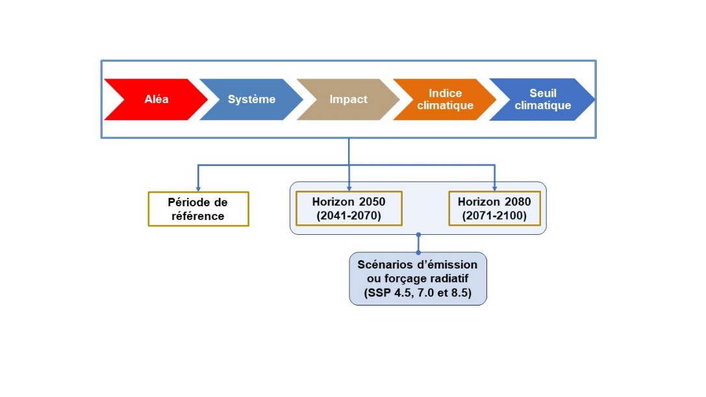
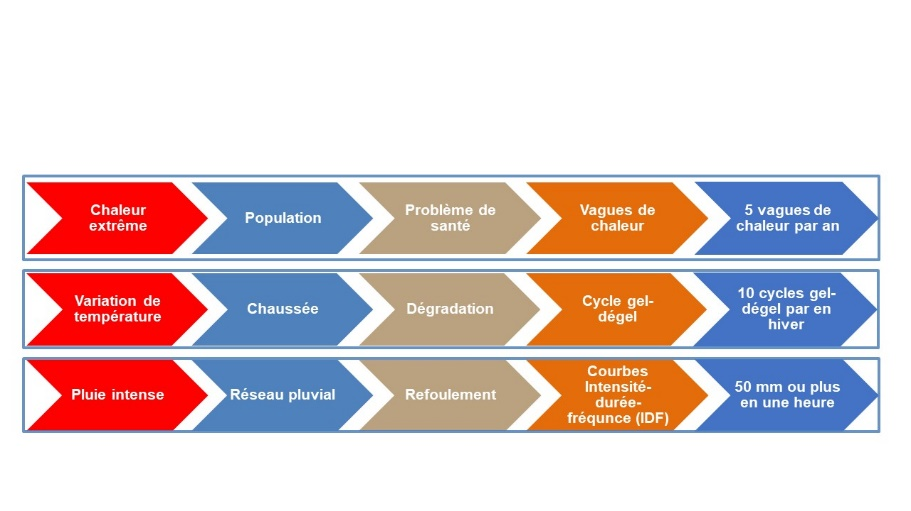

# Objectives, scope and context of the adaptation process {#sec-B2}

This step aims to: (1) define the objectives and scope of the adaptation
process; (2) establish a portrait of the organization and the territory;
(3) identify the hazards, systems and impacts to be considered; and (4)
specify the parameters of the risk analysis (@fig-B2a).

## Objectives and scope of the adaptation process

The fundamental objectives common to all adaptation processes are: (a)
to evaluate the risks posed by climate change in current and future
climates; (b) to identify adaptation needs; and (c) to define and
implement the appropriate adaptation measures. The adaptation process is
then summarized in an adaptation plan. More specific objectives can be
defined based on local issues (e.g. issues associated with coastal
erosion or forest fires).

## Portrait of the organization and the territory under its jurisdiction

A portrait of the organization undertaking an adaptation process (city,
municipality, urban community, etc.), as well as the characterization of
the territory under its jurisdiction, must first be produced.
Collaboration with other organizations whose territories are connected
and those whose jurisdictions are complementary (e.g. RCMs) may prove
essential for certain common issues (e.g. flood risk management at the
scale of a watershed) or to coordinate adaptation processes.

## Identification of hazards, systems and impacts

The , the  affected by these hazards, and the impacts
(or  of these hazards on the systems in the territory are
then listed. The systems in question include infrastructure (e.g. road
network, combined sewer and stormwater systems), populations, economic
activities, natural environments, and services^[Appendix F of @ouranos2024 presents a non-exhaustive
    list of municipal systems to consider.]. The key
hazards in Quebec are river floods (open water, ice jams) and floods
caused by rain (sewer system backup and accumulation of water in urban
areas), as well as heat waves, landslides, forest fires and coastal
erosion and submergence^[Appendix B of @ouranos2024 provides a list of possible
    hazards with their potential impacts on different systems.]. Other hazards may be important in
certain regions facing certain problems, such as thawing permafrost, air
quality degradation, or droughts. The impacts of these hazards on the
systems must then be listed. This means documenting the
hazard→system→impacts chain based on the available historical data
and documents. This exercise requires collecting information on past
hazards and their impacts on current systems for the territory under
study. In addition to this analysis, consideration should be given to
those hazards which may not have occurred in the past but risk occurring
more frequently in a future climate, and the systems they could affect.
Information on the future changes in these hazards in a future climate
must therefore be collected. Several resources are available for this
purpose (see [fact sheets @sec-C1 and @sec-C2]).

##  The parameters of the risk analysis

A risk analysis ([fact sheets @sec-B3], -@sec-B4 and -@sec-B5) requires the following
preliminary steps: (a) identification and characterization of hazards
and selection of ; (b) establishment of ; (c) identification of ; and (d) selection
of  (@fig-B2a).

### Climate hazards and indices

A more detailed characterization of the hazards must be undertaken on
the basis of the data collected in the previous step. The purpose is to
define, qualitatively or quantitatively depending on the nature of the
available data, the  (or probability of occurrence) of this
hazard in past and future climates. A qualitative evaluation will be
based on the available empirical knowledge or on expert opinions.
Otherwise, if historical data or climate projections are available, a
statistical analysis of this data will make it possible to estimate
these probabilities.

, which consist of values combining one or more climate
variables, are useful for characterizing hazards when historical data or
climate projections are available^[Appendix A of @ouranos2024 provides a list of climate
    indices with their past and future climate values for various
    regions of Quebec.]. Thus, the “heat wave”
hazard can be defined as the annual number of episodes in which the
daily maximum temperature exceeds 30°C for 3 or more consecutive
days^[Definition used in @ouranos2024. Other definitions are
    possible.]. Climate indices are used to establish the frequency of
occurrence and to quantify the amplitude of hazards in past and future
climates. They are also used as a proxy to establish the impacts of a
hazard on a given system. For example, the number of freeze-thaw cycles
is often used to evaluate the impacts of global warming on pavement
degradation, with an increase in the number of freeze-thaw cycles
suggesting greater degradation. The definition of climate indices depend
not only on the hazard, but also on the system and the type of impact
(@fig-B2a).

### Climate thresholds

Climate thresholds, beyond which the consequences or impacts (damage,
degradation, loss of use, breakdown of services, etc.) are considered
significant and important, must be set. They will vary depending on the
hazard-system-impact sequences under study. A threshold may, for
example, correspond to the capacity of certain infrastructure, to a
historical reference event, or to a point beyond which managers believe
that there will be a breakdown in services. Useful sources of
information for setting these thresholds include empirical knowledge
acquired in the past by various groups, such as municipal employees,
operators of various equipment or intervention teams, as well as the
analysis of past hazards. As an example, a threshold of 10 freeze-thaw
cycles per winter could be considered, above which road surface
degradation would become a concern (@fig-B2b). These thresholds will
be used for risk analysis (see [fact sheets @sec-B4] to -@sec-B5). @fig-B2b
shows other examples of hazard→system→impact→index→threshold
sequences.

### The reference period and time horizons

The adaptation process requires specifying which past and future periods
will be considered. The reference period is the past period, preferably
at least 30 years long, to which future climate conditions will be
compared. This period must be recent and it must be representative of
historical conditions. However, it depends on several factors, including
the period for which observed data is available. The 
refers to the future periods that will be compared to the reference
period. Two periods are recommended, to represent medium- and long-term
horizons: 2041--2070 and 2071--2100.

### Emission scenarios

Various emission scenarios, each corresponding to a possible future
change in greenhouse gas emissions and atmospheric concentrations, must
be considered. Three scenarios are commonly used — SSP2-4.5, SSP3-7.0 and
SSP5-8.5 — corresponding to increasing levels of .
Thus, each hazard→system→impact→index→threshold sequence must be
evaluated for each of the time horizons and SSPs selected, and the
results compared to the reference period (@fig-B2a). These results
will be used to carry out the risk assessment ([Fact Sheet @sec-B3]) and to
proceed with addressing the risks ([Fact Sheet @sec-B4]).

{#fig-B2a}

{#fig-B2b}

