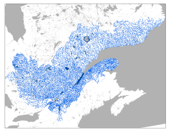

# The Hydroclimatic Atlas of Southern Québec^[The information in this fact sheet is drawn from @atlas2022.] {#sec-C2}

The Hydroclimatic Atlas of Southern Québec, developed by Quebec’s
Ministère de l’Environnement, de la Lutte contre les changements
climatiques, de la Faune et des Parcs (MELCCFP), describes the water
regimes of rivers in current and future climates. The most recent
version, which was put online in 2022, provides access to historical
river flow data from 307 hydrometric stations located in the southern
part of Quebec (@fig-C2).

It allows the public to explore the hydrological future of southern
Quebec’s watersheds in the context of climate change. Simulations from
several climate models were used as input data for a hydrological model.
A total of 76 hydrological indicators on high water levels, low water
levels and average seasonal and annual flows were simulated for sections
of the watersheds of southern Quebec.

The hydrological indicators are evaluated for four 30-year periods. One
is the past climate, 1981–2010, which is used as a reference period, and
three are future climates: 2011–2040, 2041–2070 and 2071–2100. The
indicators’ variations between reference periods and future periods are
also estimated in accordance with two greenhouse gas emission scenarios.

A level of confidence in the overall conclusions drawn from these
analyses is assigned, based on an expert opinion. A **high level of
confidence** is assigned when the key processes involved are thought to
be modelled well. A **moderate confidence level** is assigned when the
large-scale conclusions might be different at local scales or improved
modelling could lead to slightly different results. However, these
conclusions are solid and useful enough to be disseminated and used in
climate change adaptation.

The main conclusions regarding flood indicators are as
follows^[Readers are invited to consult the atlas’ technical report for the
conclusions on the low water level and flow indicators.]: (1) spring freshets will be earlier \[high
confidence\]; (2) spring freshet peak flows in northern watersheds will
increase \[moderate confidence\]; (3) spring freshet peak flows in
southern watersheds will decrease for 2- and 5-year recurrences and
increase for 100-year and greater recurrences \[moderate confidence\];
(4) summer-fall peak flows will increase \[moderate confidence\]; and
(5) spring freshet volumes will decrease in southern watersheds
\[moderate confidence\].

{#fig-C2}

