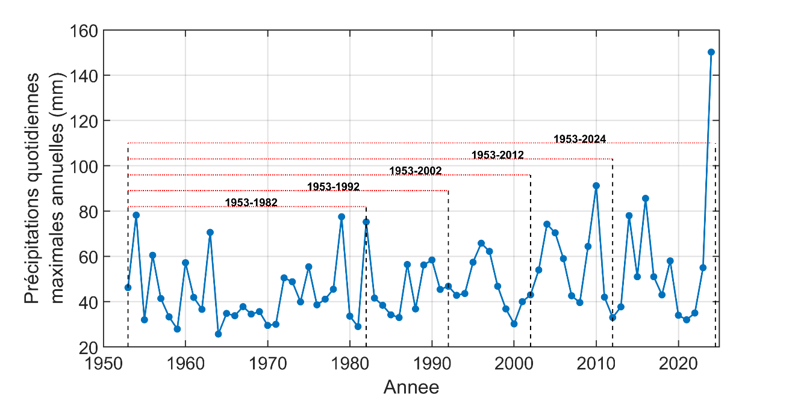

# Détection de tendances dans les séries d'extrêmes {#sec-A4}

Les changements climatiques se manifestent par une modification des caractéristiques statistiques d'une série, généralement une augmentation ou une diminution progressive de la moyenne et/ou de la dispersion (voir [fiche @sec-A3]). Or, les valeurs extrêmes sont, par définition, associées à des événements rares, d'autant plus rares qu'ils sont extrêmes. Détecter une tendance, c'est-à-dire une hausse ou une baisse de la fréquence ou de l'amplitude de tels événements, est donc difficile (voir la [fiche @sec-A6] sur les tests de tendance). Il demeure toutefois essentiel d'estimer les tendances à long terme des valeurs extrêmes, compte tenu des impacts de ce type d'événements.

Deux facteurs font en sorte que l'identification de tendances de séries extrêmes, telles les pluies extrêmes, est difficile. Le premier est la grande variabilité de ce type de série. Les précipitations maximales annuelles à la station Chelsea présentées à la [fiche @sec-A2] en sont un bel exemple. Le deuxième facteur est que l'on doit disposer de longues séries afin de pouvoir discerner le signal associé aux changements climatiques de la variabilité naturelle de la série. De fait, les séries disponibles au Québec et au Canada sont relativement courtes et les tendances difficiles à détecter.

Afin d'illustrer ce dernier point, considérons la série des pluies maximales annuelles à la station Oka[^1] présentée à la @fig-A4. Si on considère les 30 premières années, aucune tendance n'est détectée, ce que confirme l'application d'un test de tendance (p-value de 0.915 pour le test de Mann-Kendall; voir la [fiche @sec-A6]). Une tendance se dessine au fur et à mesure que s'ajoutent des données et que des périodes historiques de plus en plus longues sont considérées (@tbl-A4).

L'application du test de Mann-Kendall montre en effet que l'hypothèse d'une absence de tendance peut être rejetée au seuil de significativité de 95% lorsque les séries couvrent les périodes 1953–2012 de 60 ans et 1953–2024 de 72 ans. Ainsi, bien que nous soyons en présence d'une série remarquablement longue, il faut disposer de 60 ans ou plus avant de commencer à discerner une tendance alors qu'aucune tendance significative n'est détectée lorsque la série couvre la période 1953-2002. Ce résultat montre également qu'il faut demeurer très prudent lorsque des tendances sont détectées sur de courtes séries puisqu'elles peuvent avoir été générées de façon aléatoire et ne pas être la signature de tendances réelles.

Plusieurs autres éléments sont à prendre en compte lors d'analyses de tendances et au moment d'interpréter les résultats. Ainsi pour les variables soumises à des effets de saisonnalité ou à des phénomènes cycliques (p. ex. El Niño), il est important de considérer des séries couvrant plusieurs cycles, sinon la tendance détectée sera factice.

{#fig-A4}

::: {#tbl-A4 tbl-colwidths="[25,25,25,25]"}
| Période    | p-value du test de Mann-Kendall | Tendance significative (seuil de 5%) | Taux de variation (%/décennie) |
|------------|---------------------------------|--------------------------------------|--------------------------------|
| 1953-1982  | 0.915                           | Non                                  | \-                             |
| 1953-1992  | 0.449                           | Non                                  | \-                             |
| 1953-2002  | 0.222                           | Non                                  | \-                             |
| 1953-2012  | 0.034                           | Hausse                               | 4.6                            |
| 1953-2024  | 0.020                           | Hausse                               | 3.7                            |

Application du test de Mann-Kendall à différentes périodes de la série des précipitations maximales annuelles à la station Oka (voir @fig-A4). Le taux de variation n'a été calculé que dans les cas où la tendance est statistiquement significative. Le taux de variation des précipitations maximales annuelles a été estimé à l'aide de la pente de Sen, aussi appelée pente de Theil-Sen.
:::

[^1]: La station Oka (7024010) est opérée par le ministère de l'Environnement, de la Lutte contre les changements climatiques, de la Faune et des Parcs (MELCCFP). 