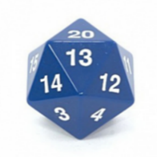

# Représentation probabiliste des extrêmes {#sec-A5}

Les événements extrêmes ne sont pas prévisibles à moyen ou long terme. Une représentation probabiliste est donc nécessaire où la probabilité d'occurrence de ces événements est estimée. Les pluies extrêmes en sont un exemple où les probabilités annuelles d'occurrence de pluies de diverses intensités sont estimées. La présente fiche explique comment ces probabilités sont calculées et énoncent les principales hypothèses sous-jacentes.

Considérons les pluies ayant une probabilité de 5 % de se produire chaque année. La période de retour, qui correspond au nombre moyen d'années séparant deux occurrences consécutives de ces pluies, est de T = 1/0.05 = 20 ans. Si on considère les pluies plus rares, par exemple de période de retour 100 ans, elles auront une probabilité de 1 % de survenir chaque année.

La représentation probabiliste ainsi adoptée est tout à fait équivalente à un jeu de hasard. Pour une pluie avec une probabilité d'occurrence de 5 %, ou 1/20, l'occurrence ou non d'un tel événement à une année donnée est équivalente au lancer d'un dé à vingt faces (Figure A.5). Advenant que le dé tombe sur une face donnée, par exemple '20', alors l'événement en question survient, autrement il ne survient pas. Ceci implique que chaque résultat est 'statistiquement indépendant' du résultat précédent, c.-à-d. que la probabilité de tirer un '20' à chaque lancer demeure de 1/20 peu importe le résultat du lancer précédent[^1]. Ainsi, il est possible de tirer 5 fois le nombre 20 d'affilée, même si la probabilité d'un tel résultat est très faible (moins de 1 chance sur 3 millions !). Le @tbl-A5 donne les probabilités de tirer 0, 1, 2, 3, 4 ou 5 fois et plus une face donnée lorsqu'un dé à 20 faces est lancé 20 fois. On peut voir que le nombre de fois le plus probable est 1, avec une probabilité de 37.7 %, mais qu'il est très probable de ne pas tomber sur une face donnée (35.8 %) ou de tirer plus d'une fois cette face (26.5 %). En d'autres mots, même si une pluie de période de retour 20 ans est observée en moyenne à tous les 20 ans, il est très probable de ne pas l'observer pendant une période de 20 ans (35.8 %) ou de l'observer deux fois ou plus pendant cette même période (26.5 %)[^2].

::: columns
::: {.column width="70%"}

::: {#tbl-A5}

| Nombre de fois où la face est tirée | Probabilité |
|-------------------------------------|-------------|
| 0                                   | 35.8%       |
| 1                                   | 37.7%       |
| 2                                   | 18.9%       |
| 3                                   | 6.0%        |
| 4                                   | 1.3%        |
| 5 ou plus                           | 0.3%        |

Probabilités de tirer 0,1, 2, 3, 4 ou 5 fois et plus une face donnée lorsque qu'un dé à 20 faces est lancé 20 fois. 
:::

:::
::: {.column width="5%"}
:::

::: {.column width="25%"}
{#fig-A5}
:::
:::

[^1]: L'indépendance statistique dans le cas des pluies extrêmes demeure une hypothèse puisque certains phénomènes périodiques comme El Niño peuvent faire en sorte que les pluies maximales annuelles enregistrées pendant un cycle El Niño sont plus ou moins corrélées selon la région considérée.

[^2]: Le nombre moyen d'occurrence d'un événement de probabilité p après N tirages est p N. 