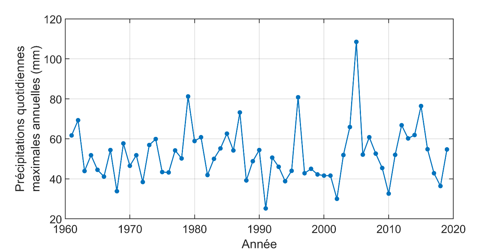
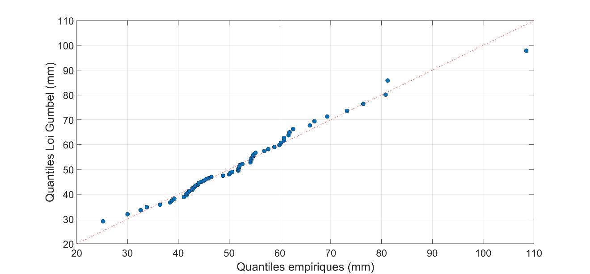

# Distribution statistique des valeurs extrêmes et loi de Gumbel {#sec-A7}

Les probabilités d'occurrence des valeurs extrêmes dans une série aléatoire stationnaire sont souvent représentées par la loi de Gumbel, qui est un cas particulier^[La loi de Gumbel correspond au cas où le paramètre de forme de la loi des valeurs extrêmes généralisée est nul.] de la loi des valeurs extrêmes généralisée^[L'utilisation de la loi de Gumbel et de la loi des valeurs extrêmes généralisée est basée sur des considérations théoriques. Les lecteurs qui souhaitent plus de détails peuvent consulter @coles2001.]. La loi de Gumbel est utilisée par Environnement et Changement climatique Canada (ECCC) dans la construction des courbes Intensité-Durée-Fréquence (IDF)^[Pour plus de détails, voir [Données climatiques pour l'ingénierie](https://climate.weather.gc.ca/prods_servs/engineering_f.html).], entre autres.

La fonction de densité de probabilité^[La fonction de densité de probabilité $f(x)$ définit la probabilité que la valeur x soit égale à une valeur donnée. Ainsi, $f(x)$ dx est la probabilité que x soit inclus dans l'intervalle $[x,x + dx]$.] de la loi de Gumbel, $f_{G}\left( x \right)$, est donnée par :

$$f_{G}(x) = \sigma^{-1} z \exp(-z)$$

avec :

$$z = \exp \left[ \frac{-(x - \mu)}{\sigma} \right]$$

où $\mu$ est le paramètre de position et $\sigma$ le paramètre d'échelle de la distribution^[La moyenne de la loi de Gumbel est $\mu + \sigma\gamma$ où $\gamma$ est la constante d'Euler-Mascheroni ($\gamma \approx 0,5772$) et la variance est donnée par $\frac{\pi^{2}\sigma^{2}}{6}$.].

La fonction de répartition^[La fonction de répartition $F\left( x \right)$ définit la probabilité que la variable X soit inférieure à la valeur x, c'est-à-dire $P\left( X < x \right) = F\left( x \right)$.] correspondante est donnée par :

$$F_{G}(x) = \exp(-z)$$

La méthode des moments^[Plusieurs autres méthodes d'estimation existent et présentent certains avantages par rapport à la méthode des moments (p. ex. l'estimation par maximum de vraisemblance ou la méthode des L-moments). La méthode des moments est celle utilisée par ECCC pour créer les courbes IDF au Canada.] peut être utilisée pour estimer les paramètres de la loi de Gumbel pour une série donnée. Si $\overline{x}$ et s sont la moyenne et l'écart-type de la série, alors les paramètres de position $\hat{\mu}$ et d'échelle $\hat{\sigma}$ de la loi de Gumbel ajustée à cette série sont obtenus à partir des expressions suivantes :

$$\begin{align}
\widehat{\sigma} &= \sqrt{6} \left( \frac{s}{\pi} \right) \\
\widehat{\mu} &= \overline{x} - \frac{\sqrt{6} \gamma s}{\pi}
\end{align}$$

où $\gamma$ est la constante d'Euler-Mascheroni ($\gamma \approx 0.5772$). Enfin, on peut estimer un quantile pour une période de retour T donnée (en années) en inversant la fonction de répartition $F$ :

$$X = \widehat{\mu} - \widehat{\sigma} \ln \left[ - \ln \left( 1 - \frac{1}{T} \right) \right]$$

La loi de Gumbel a été ajustée aux valeurs de la série des précipitations maximales journalières annuelles à la station de l'aéroport Jean-Lesage^[La station de l'aéroport Jean-Lesage (7016294-701S001) est opérée par Environnement et Changement climatique Canada.] au Québec (@fig-A7a). Les valeurs des paramètres de position et d'échelle après ajustement sont $\hat{\mu} = 46.1$ et $\hat{\sigma} = 10.9$. Un graphique quantile-quantile^[Les graphiques quantile-quantile comparent les quantiles estimés à partir de la loi ajustée aux données avec les quantiles empiriques correspondants.] comparant les quantiles estimés à partir de la loi de Gumbel aux quantiles empiriques^[Les quantiles empiriques ont été estimés en utilisant l'estimateur de quantile de Cunnane.] est présenté à la @fig-A7b. On peut voir que l'accord entre les quantiles empiriques et ceux de la loi de Gumbel est satisfaisant et, par conséquent, on peut conclure que la loi de Gumbel ajustée représente adéquatement la série des précipitations maximales journalières annuelles à la station de l'aéroport Jean-Lesage.

{#fig-A7a}

{#fig-A7b} 
