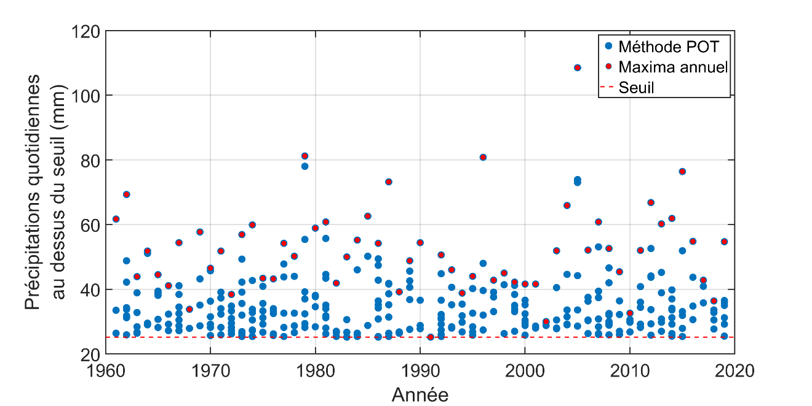

# Approche Peak-Over-Threshold (POT) {#sec-A8}

La série des maxima annuels ne comprend que la valeur la plus élevée enregistrée chaque année. Par exemple, considérons la série des précipitations maximales journalières annuelles à la station de l'aéroport Jean-Lesage^[La station de l'aéroport Jean-Lesage (7016294-701S001) est opérée par Environnement et Changement climatique Canada.] au Québec, présentée à la @fig-A7a. Puisqu'une seule valeur est retenue chaque année, il est possible que des précipitations journalières entre le plus grand et le plus petit maximum annuel de la série aient été observées certaines années, mais n'aient pas été retenues aux fins d'analyse. Si on extrait ces valeurs, on obtient la série présentée à la @fig-A8. On peut voir que plusieurs événements pluvieux relativement importants ne sont pas retenus lorsqu'on utilise uniquement les valeurs maximales annuelles, comme en 2005 (l'année où la valeur la plus élevée a été enregistrée).

L'approche Peak-Over-Threshold [@coles2001; @mailhot2013] (POT) permet d'intégrer ces valeurs dans les analyses. Elle consiste à définir un seuil et à retenir toutes les valeurs au-dessus de ce seuil. La série des valeurs au-dessus du seuil est appelée série de durée partielle. La loi de Pareto généralisée^[Voir @coles2001 pour plus de détails sur la loi de Pareto généralisée.] est ensuite ajustée à ces données et utilisée pour estimer différents quantiles extrêmes.

L'identification du seuil est délicate et constitue probablement la principale difficulté de la méthode POT. Plusieurs approches ont été proposées pour fixer le seuil, mais le seuil reste en partie arbitraire et son choix influence les résultats (pour une discussion de ce point, voir @coles2001). Bien que l'utilisation de la méthode POT puisse, en principe, améliorer l'inférence des quantiles extrêmes, sa mise en œuvre pratique nécessite une certaine expertise.

La mise en œuvre de l'approche POT nécessite également de disposer d'archives de données historiques avec des pas de temps courts (p. ex. séries de 5 minutes ou horaires) afin de pouvoir extraire les valeurs au-dessus de seuils donnés. Seuls les maxima annuels de pluie de diverses durées sont disponibles dans les archives de données historiques au Canada, ce qui rend impossible l'extraction des valeurs au-dessus d'un seuil donné. Pour cette raison, l'approche POT ne peut pas être utilisée pour construire les courbes Intensité-Durée-Fréquence (IDF). L'utilisation de la méthode POT pourrait s'avérer avantageuse dans les cas où des séries continues de pluie sont disponibles.

{#fig-A8} 
