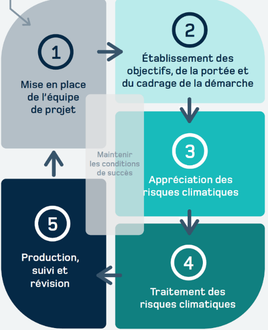

# Démarche d'adaptation aux changements climatiques {#sec-B1}

Les changements climatiques entraineront des modifications importantes de plusieurs variables climatiques. Ces conditions climatiques inédites mettront à mal la fonctionnalité de plusieurs infrastructures, compromettront plusieurs services, perturberont les activités socioéconomiques, porteront atteinte à la qualité de vie et à la santé des populations et mettront en péril divers systèmes naturels et la survie de certaines espèces. L'adaptation aux changements climatiques vise à mettre en place diverses mesures afin de limiter ces impacts, d'améliorer la résilience de nos sociétés et, le cas échéant, de tirer profit des effets bénéfiques des changements climatiques. Par ailleurs, diverses actions humaines pourront faciliter la transition climatique des systèmes naturels.

::: columns
::: {.column width="45%"}
{#fig-B1}
:::
::: {.column width="5%"}
:::
::: {.column width="50%"}
L'adaptation aux changements climatiques est donc essentielle. La @fig-B1, tirée de @ouranos2024, présente les étapes de la démarche d'adaptation visant à identifier les risques climatiques et les mesures permettant d'atténuer les impacts de ces changements sur divers systèmes et, ultimement, à produire un plan d'adaptation. Cette démarche se décline en cinq étapes :

1. mise en place de l'équipe de projet ;
2. établissement des objectifs, de la portée et du cadrage de la démarche ;
3. appréciation des risques climatiques ;
4. traitement des risques climatiques ;
5. production, suivi et révision.

:::
:::

La mise en place de l'équipe de projet a principalement pour objectif d'identifier le responsable de la démarche et les membres de l'équipe qui réaliseront les travaux. Le rôle de cette équipe, qui devra inclure des représentants de divers services, est d'élaborer le plan et assurer sa mise en œuvre. Divers experts pourront également s'adjoindre à l'équipe en tant que conseillers et intervenir ponctuellement en soutien à cette démarche. L'engagement de tous les membres de l'équipe est essentiel afin de garantir le succès de la démarche d'adaptation.

Les fiches techniques -@sec-B2 à -@sec-B4 discutent des étapes 2 à 4 de la démarche d'adaptation. La [fiche @sec-B5] aborde le concept et la matrice de risque, et la [fiche @sec-B6] présente un exemple d'application.

L'adaptation aux changements climatiques doit impérativement s'accompagner de mesures d' visant à réduire les émissions de gaz à effet de serre (GES). Au Québec, la démarche d'adaptation vient en support au plan climat [@melccfp2024] qui permet aux organismes municipaux de se doter d'un document de planification qui couvre à la fois les enjeux d'adaptation et d'atténuation.

