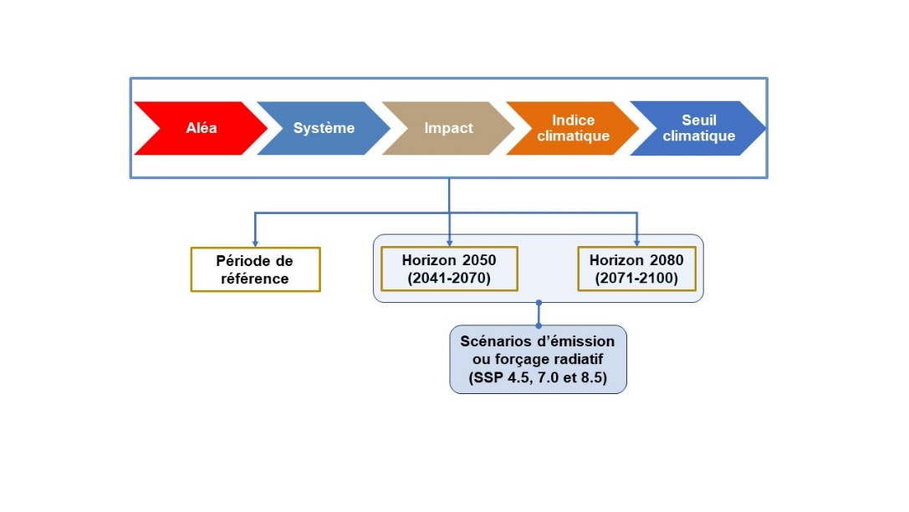
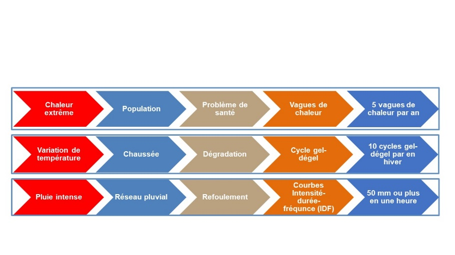

# Objectifs, portée et cadre de la démarche d'adaptation {#sec-B2}

Cette étape vise à : 1) définir les objectifs et la portée de la démarche d'adaptation ; 2) établir le portrait de l'organisation et du territoire; 3) identifier les aléas, systèmes et impacts à considérer ; 4) préciser les paramètres de l'analyse de risque (@fig-B2a).

## Objectifs et portée de la démarche d'adaptation

Les objectifs fondamentaux communs à toutes les démarches d'adaptation sont : a) d'évaluer les risques posés par les changements climatiques en climat actuel et futur ; b) de définir les besoins d'adaptation ; c) d'identifier et de mettre en place les mesures d'adaptation adéquates. La démarche d'adaptation est ensuite résumée dans un plan d'adaptation. Des objectifs plus spécifiques peuvent toutefois être définis en fonction d'enjeux locaux (p. ex. enjeux d'érosion côtière ou de feux de forêt).

## Portrait de l'organisation et du territoire sous sa juridiction

Un portrait de l'organisation qui entreprend une démarche d'adaptation (ville, municipalité, communauté urbaine, etc.), de même qu'une caractérisation du territoire sous sa juridiction, doivent d'abord être réalisés. Une collaboration avec d'autres organisations dont les territoires sont connexes et les juridictions complémentaires (p. ex. les MRC) peut s'avérer essentielle pour certains enjeux communs (p. ex. gestion des risques d'inondations à l'échelle d'un bassin versant) ou afin de coordonner les démarches d'adaptation entreprises sur ces territoires.

## Identification des aléas, systèmes et des impacts

Les , les  affectés par ces aléas et les impacts (ou ) de ces aléas sur les systèmes présents sur le territoire d'étude seront ensuite répertoriés. Les systèmes en question incluent les infrastructures (p. ex. réseau routier, réseaux d'égout unitaires et pluviales), les populations, les activités économiques, les milieux naturels et les services^[L'Annexe F de @ouranos2024 présente une liste non-exhaustive des systèmes municipaux à considérer.]. Les aléas les plus pertinents pour le Québec sont les inondations fluviales (eau libre, embâcle) et pluviales (refoulement réseau d'égout et accumulation d'eau en milieu urbain), les vagues de chaleur, les glissements de terrain, les incendies de forêts et l'érosion et la submersion côtière^[L'Annexe B de @ouranos2024 propose une liste des aléas possibles avec leurs impacts potentiels sur différents systèmes.]. D'autres aléas peuvent être pertinents pour certaines régions aux prises avec certaines problématiques, telle la fonte du pergélisol, la dégradation de la qualité de l'air ou encore les sécheresses. Les impacts de ces aléas sur les systèmes doivent ensuite être répertoriés. Il s'agit donc de documenter la chaîne aléa → système → impacts à partir des données et des documents historiques disponibles. Cet exercice exige de colliger des informations sur les aléas passés et leurs impacts sur les systèmes présents pour le territoire sous étude. Cette analyse sera complétée par une réflexion sur des aléas qui, sans qu'ils se soient produits par le passé, risquent de survenir plus fréquemment en climat futur et sur les systèmes qui pourraient être affectés par ces aléas. Les informations relatives à l'évolution future de ces aléas en climat futur doivent ainsi être colligées. Plusieurs ressources sont disponibles à ce sujet (voir les [fiches @sec-C1] et -@sec-C2).

## Préciser les paramètres de l'analyse de risque

L'analyse de risque ([fiches @sec-B3], -@sec-B4 et -@sec-B5) exige de procéder au préalable à : a) l'identification et la caractérisation des aléas, et à la sélection d' ; b) l'établissement de  ; c) l'identification des  ; d) la sélection des  (@fig-B2a).

### Aléas et indices climatiques

Une caractérisation plus fine des aléas doit être entreprise sur la base des données colligées à l'étape précédente. Elle vise à définir de façon qualitative ou quantitative, selon la nature des données disponibles, la  (ou la probabilité d'occurrence) de cet aléa en climat passé et futur. Une évaluation qualitative s'appuiera sur les connaissances empiriques disponibles ou l'avis d'experts. Autrement, lorsque des données historiques ou des projections climatiques sont disponibles, une analyse statistique de ces données permettra d'estimer ces probabilités d'occurrence.

Des , qui consistent en des valeurs combinant une ou plusieurs variables climatiques, sont utiles pour caractériser les aléas lorsque l'on dispose de données historiques ou de projections climatiques^[L'Annexe A de @ouranos2024 propose une liste d'indices climatiques avec leurs valeurs en climat passé et futur pour diverses régions du Québec.]. Ainsi, l'aléa 'vague de chaleur' peut être défini comme le nombre annuel d'épisodes où la température maximale quotidienne dépasse 30°C pendant 3 jours consécutifs ou plus^[Définition utilisée dans @ouranos2024. D'autres définitions sont toutefois possibles.]. Les indices climatiques servent à établir la fréquence d'occurrence et à quantifier l'amplitude des aléas en climat passé et futur. Ils sont également utilisés comme *proxy* pour établir les impacts d'un aléa sur un système donné. À titre d'exemple, le nombre de cycles de gel-dégel est souvent utilisé pour évaluer les impacts du réchauffement climatique sur la dégradation des chaussées, une augmentation du nombre de cycles de gel-dégel étant associée à une dégradation plus importante. Les indices climatiques dépendent non seulement de l'aléa, mais également du système et du type d'impact (@fig-B2a).

### Seuils climatiques

Des seuils climatiques, variables selon les séquences aléa-système-impact à l'étude, doivent être fixés au-delà desquels les conséquences ou les impacts (dommages, dégradation, pertes d'usages, bris de services, etc.) sont jugés significatifs et importants. Ce seuil peut, par exemple, correspondre à la capacité d'une infrastructure, à un événement historique de référence ou encore à un point au-delà duquel les responsables estiment qu'il y aura bris de services. Les connaissances empiriques acquises par le passé par divers groupes, tels les employés municipaux, les opérateurs de divers équipements ou les équipes d'intervention, de même qu'une analyse des aléas passés, pourront être des sources d'informations utiles pour fixer ces seuils. A titre d'exemple, un seuil de 10 cycles de gel-dégel par hiver pourrait être considéré, au-dessus duquel la dégradation des chaussées deviendrait préoccupante (@fig-B2b). Ces seuils seront utilisés pour l'analyse de risque (voir les [fiches @sec-B4] à -@sec-B5). La @fig-B2b présente d'autres exemples de séquences aléa → système → impact → indice → seuil.

### Période de référence et horizons temporels

La démarche d'adaptation exige de préciser quelles périodes passée et future seront considérées. On désigne par *période de référence*, la période passée, préférablement d'une durée minimale de 30 ans, à laquelle seront comparées les conditions climatiques futures. Cette période doit être récente et représentative des conditions historiques. Elle dépend toutefois de plusieurs facteurs, notamment, la période pour laquelle on dispose de données observées. Les  désignent les périodes futures qui seront comparées à la période de référence. Deux périodes sont recommandées pour représenter des horizons à moyen et long terme : 2041-2070 et 2071-2100.

### Scénarios d'émission

Divers scénarios d'émissions, chacun correspondant à une évolution future possible des émissions et des concentrations atmosphériques de gaz à effet de serre, doivent être considérés. Trois scénarios sont couramment utilisés, SSP2-4.5, SSP3-7.0 et SSP5-8.5, correspondant à des  croissants. Ainsi, chaque séquence aléa → système → impact → indice → seuil devra être évaluée pour chacun des horizons temporels et SSP retenus, et les résultats comparés à la période de référence (@fig-B2a). Ces résultats serviront à réaliser l'appréciation des risques ([fiche @sec-B3]) et à procéder au traitement des risques ([fiche @sec-B4]).

{#fig-B2a}

{#fig-B2b} 
