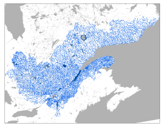

# Atlas hydroclimatique du Québec {#sec-C2}

L'Atlas hydroclimatique du Québec, développé par le ministère de l'Environnement, de la Lutte contre les changements climatiques, de la Faune et des Parcs (MELCCFP), est un outil décrivant le régime hydrique des rivières en climat actuel et futur^[Les informations de cette fiche technique sont tirées de @atlas2022.]. La plus récente version de l'Atlas, mise en ligne en 2022, couvre la partie méridionale du Québec et donne également accès aux données historiques de débits de 307 stations hydrométriques déployées sur ce territoire (@fig-C2).

L'Atlas hydroclimatique permet d'explorer le devenir hydrologique des bassins versants du Québec méridional dans un contexte de changements climatiques. Les simulations de plusieurs modèles climatiques ont été utilisées comme données d'entrée d'un modèle hydrologique. Un total de 76 indicateurs hydrologiques sur les crues, les étiages et les débits moyens saisonniers et annuels ont ainsi été simulés sur les tronçons des bassins versants du Québec méridional.

Les indicateurs hydrologiques sont évalués pour quatre périodes de 30 ans, l'une en climat passé, 1981−2010, utilisée comme période de référence, et trois en climat futur, 2011−2040, 2041−2070, 2071−2100. Les variations des indicateurs entre périodes future et de référence sont aussi estimées selon deux scénarios d'évolution des émissions de gaz à effet de serre.

Un niveau de confiance sur les conclusions générales tirées de ces analyses est attribué, basé sur un jugement d'expert. Un **niveau de confiance élevé** est attribué lorsque l'on estime les processus clés en jeu adéquatement modélisés. Un **niveau de confiance modéré** est attribué lorsque les conclusions à grande échelle pourraient être différentes à l'échelle locale ou qu'une amélioration de la modélisation puisse conduire à des résultats légèrement différents. Ces conclusions demeurent toutefois suffisamment solides et pertinentes pour être diffusées et être utilisées dans un contexte d'adaptation.

Les principales conclusions de l'Atlas au sujet des indicateurs de crues sont les suivantes^[Le lecteur est invité à consulter le rapport technique de l'Atlas pour connaitre les conclusions au sujet des indicateurs sur les étiages et l'hydraulicité.] :

1) les crues printanières seront plus hâtives [confiance élevée] ;
2) les débits de pointe des crues printanières des bassins versants situés au nord augmenteront [confiance modérée] ;
3) les débits de pointe des crues printanières pour les bassins situés au sud diminueront pour les récurrences de 2 et 5 ans et augmenteront pour les récurrences de 100 ans et plus [confiance modérée] ;
4) les débits de pointe des crues d'été-automne augmenteront [confiance modérée] ;
5) le volume des crues printanières diminuera pour les bassins situés au sud [confiance modérée].

::: {#fig-C2}

Réseau hydrographique considéré dans l'Atlas hydroclimatique
:::
