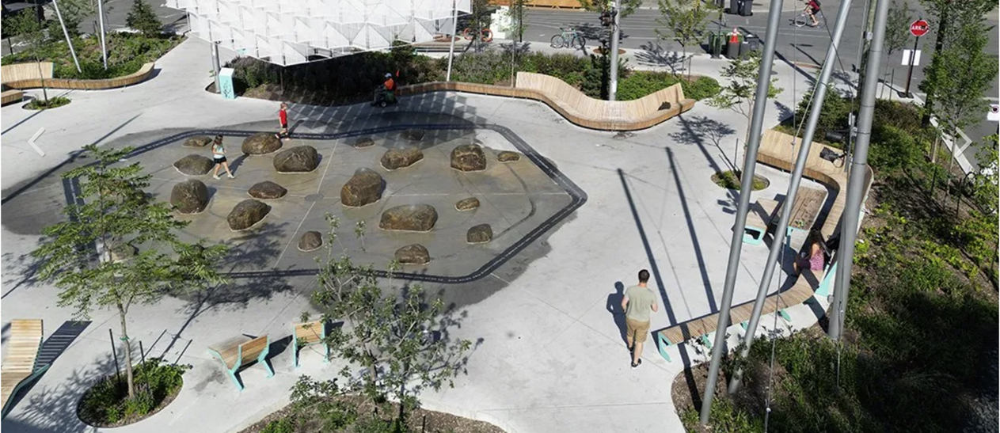

# Gestion des eaux pluviales et changements climatiques {#sec-C3}

Les pluies extrêmes seront fortement affectées par les changements climatiques (voir la [fiche @sec-A3] pour une définition des pluies extrêmes). Considérant que plusieurs infrastructures et ouvrages hydrauliques actuellement en place ont été dimensionnés en fonction des intensités des pluies extrêmes historiques, une modification de l'intensité et de la fréquence des pluies aura des conséquences majeures, notamment pour la gestion des eaux pluviales en milieu urbain.

Bien que l'amplitude des variations projetées demeure incertaine et variable selon les modèles climatiques, le signal vers une intensification des pluies extrêmes fait consensus [@bush2019]. Cette intensification sera vraisemblablement d'autant plus importante que l'événement de pluie sera de courte durée et plus extrême. On assistera donc à une augmentation de la fréquence et de l'intensité de pluies extrêmes, de même qu'à l'occurrence d'événements pluvieux sans précédents. Les dépassements des capacités des ouvrages en place seront plus fréquents et entraîneront des conséquences majeures. Plusieurs événements pluvieux ayant frappés des territoires urbains au cours des dernières années en sont l'illustration.

Il est donc essentiel de mettre en place des mesures afin de réduire le risque associé à ce type d'aléa en milieu urbain^[@ouranos2024; @melccfp2024]. Celles-ci peuvent avoir pour objectif de : 

1) convertir les surfaces imperméables en surfaces perméables (p. ex. pavés perméables); 
2) rediriger les eaux de ruissellement de surfaces imperméables vers des aménagements favorisant leur infiltration ou leur stockage temporaire (p. ex. infrastructures vertes); 
3) de revoir les critères de conception de certains ouvrages tels les réseaux, les bassins et les ponceaux afin d'augmenter leur capacité. 

Ces mesures doivent cependant faire l'objet d'une mise en place à grande échelle pour être efficaces, ce qui ne peut se faire qu'au fil de la réhabilitation des réseaux et des secteurs urbains. Elles amélioreront la résilience face aux pluies de faibles intensités ou d'intensités modérées, mais leur efficacité sera limitée face aux pluies extrêmes qui satureront les sols, entraîneront des accumulations d'eau, des refoulements de réseaux et inonderont certains secteurs.

D'autres mesures doivent être envisagées pour les pluies les plus extrêmes. Il est aussi important de réfléchir à ce qui se passera lorsque la capacité des ouvrages sera dépassée et de s'interroger sur les parcours que ces eaux excédentaires emprunteront afin de mettre en place des mesures adaptées à ces situations exceptionnelles. Un exemple est d'utiliser des espaces publics stratégiquement placés sur le territoire où ces eaux excédentaires ruisselleront et pourront être stockées temporairement. Elles pourront ensuite être infiltrées ou redirigées vers le réseau. La place multifonctionnelle inondable (*water square* en anglais) de la Place des Fleurs de Macadam à Montréal est un exemple de tel aménagement (@fig-C3). Il s'agit d'un espace public inondable qui recueille les eaux de ruissellement lors d'événements de pluie majeure. En absence de précipitations, ce lieu public aménagé est accessible aux citoyens.

::: {#fig-C3}

Place multifonctionnelle inondable (*water square*) de la Place des Fleurs de Macadam à Montréal (image tirée du site de la ville de Montréal).
:::
